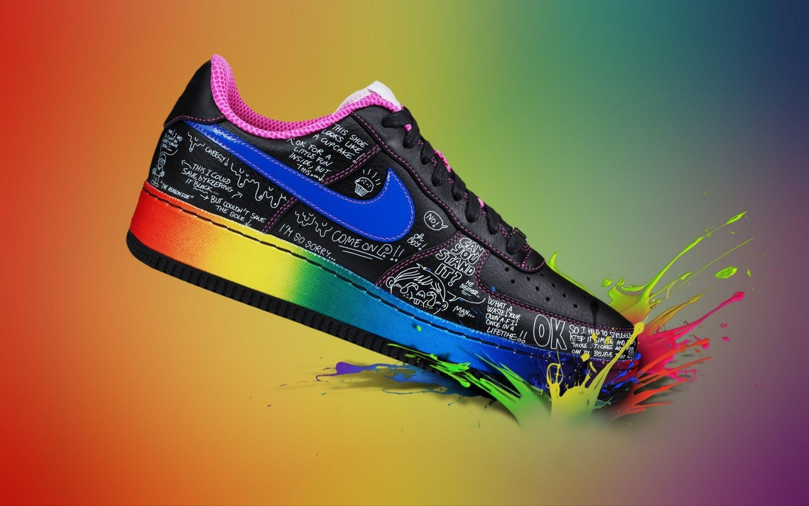
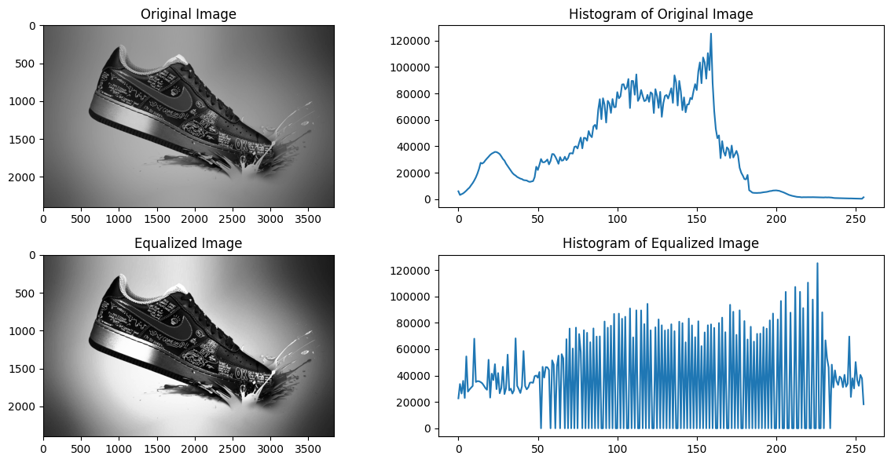
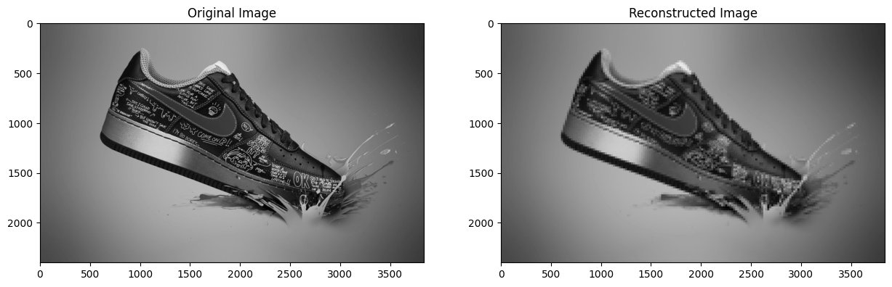
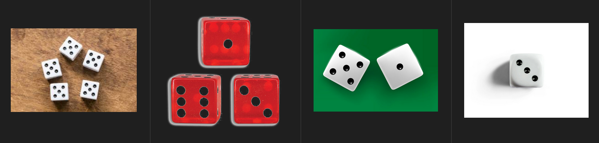
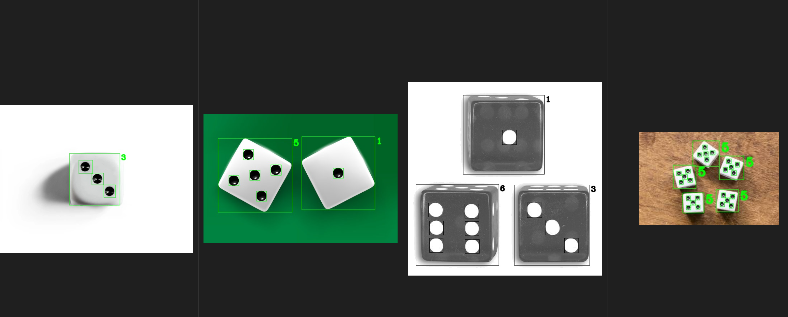
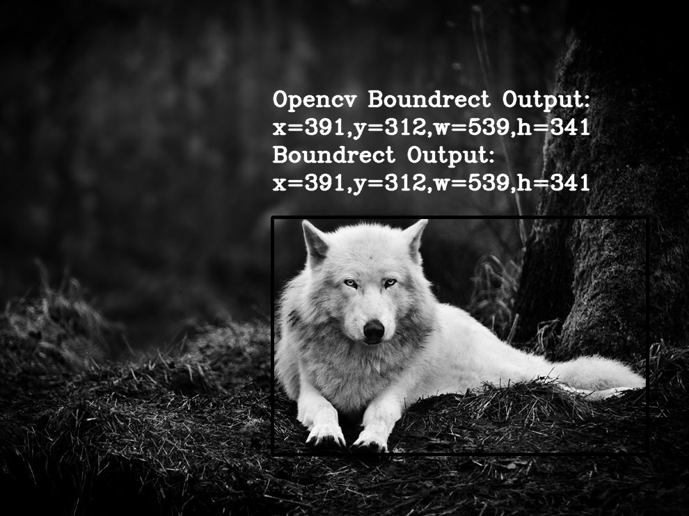
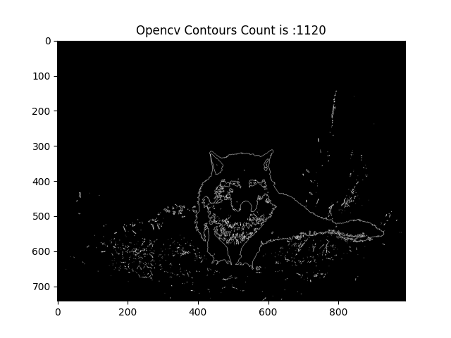
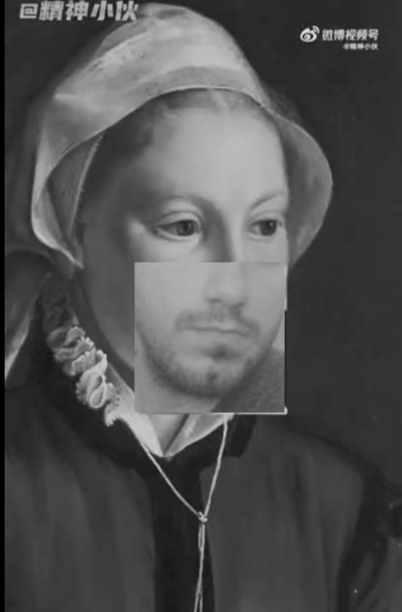
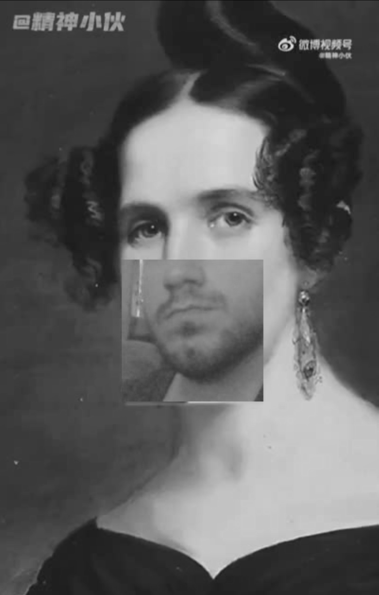
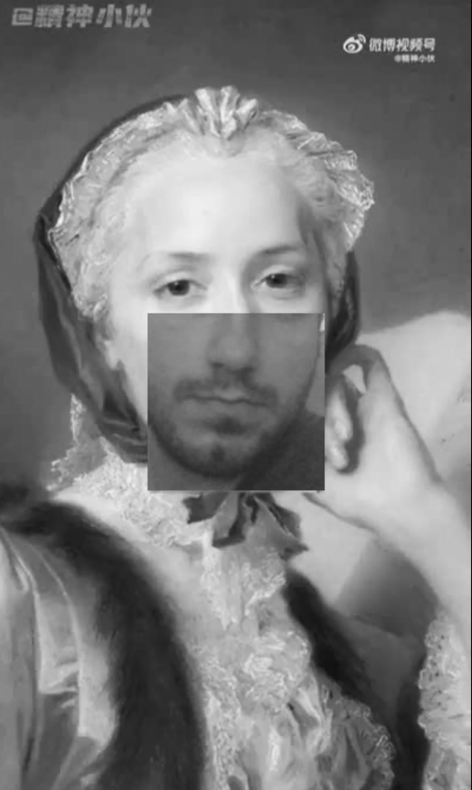

# Assigment 33


# 1. Histogram to Image
+ It is not possible to create image from histogram.

But 
* Apply five 2D filters with different kernels on your custom image. 

+ Write a function to reconstruct image from a given histogram!

## How to Install
Run following commend :
```
pip install -r requirments.txt
```

## Input



## Results





-----------------------------------------
## 2. Dice Recognition
+ Write a notebook for count the number of dots - that's the number on the dice.

  Hint: use the hierarchy to find children and parent contours.


## How to Install
Run following commend :
```
pip install -r requirments.txt
```

## Input




## Results




-----------------------------------------

## 3. Implement cv2.boundingRect() function from scratch.

`x, y, w, h = cv2.boundingRect(contour)`

## How to Install
Run following commend :
```
pip install -r requirments.txt
```
## How to Run
Execute this command in terminal :
```
python BoundingRect.py
```

## Input


## Results



## 4. Implement cv2.contourArea() function from scratch.

`area = cv2.contourArea(contours)`

## How to Install
Run following commend :
```
pip install -r requirments.txt
```
## How to Run
Execute this command in terminal :
```
python ContourArea.py.py
```

## Input


## Results


## 5. Implement cv2.findContours() function from scratch.

`contours, _ = cv2.findContours(image, cv.RETR_EXTERNAL, cv.CHAIN_APPROX_NONE)`

## How to Install
Run following commend :
```
pip install -r requirments.txt
```
## How to Run
Execute this command in terminal :
```
python FindContours.py
```

## Input


## Results



-----------------------------------------


## 6. Funny Webcam Application 😂

+ In this project, an application was created to replace your mouth and nose with an image.


## How to Install
Run following commend :
```
pip install -r requirments.txt
```
## How to Run
Execute this command in terminal :
```
python Funny_Webcam_Application.py
```


## Results






